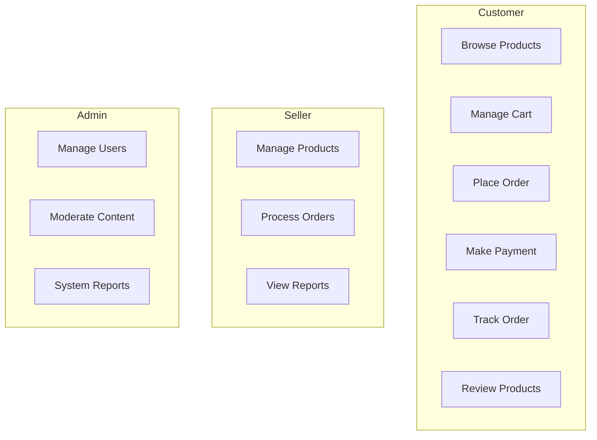

<div align="center">

# 🛒 E-Commerce Platform

[](https://openjdk.org/)
[](https://spring.io/projects/spring-boot)
[](https://reactjs.org/)
[](https://vitejs.dev/)
[](LICENSE)

**A modern, full-featured e-commerce web platform with AI-powered features**

[Getting Started](#-getting-started) •
[Features](#-features) •
[Tech Stack](#%EF%B8%8F-technology-stack) •
[Documentation](#-api-documentation)

---

## 📋 Table of Contents

- [Project Overview](#-project-overview)
- [Team Members](#-team-members)
- [Project Objectives](#-project-objectives)
- [Features](#-features)
- [System Architecture](#-system-architecture)
- [Technology Stack](#%EF%B8%8F-technology-stack)
- [Use Case Summary](#-use-case-summary)
- [Order Status Flow](#-order-status-flow)
- [CI/CD Pipeline](#-cicd-pipeline)
- [Getting Started](#-getting-started)
- [API Documentation](#-api-documentation)
- [Contributing](#-contributing)
- [License](#-license)

---

## 📖 Project Overview

This project is an **E-Commerce Web Platform** developed as a **group assignment for the SWD392 course** at FPT University.

The system provides a complete online shopping experience, including:

- 🛍️ Product browsing & search
- 🛒 Shopping cart management
- 💳 Online payment processing
- 📦 Order tracking
- ⭐ Product reviews & ratings
- 🤖 AI-assisted features

The platform supports multiple roles (**Customer**, **Seller**, and **Admin**) and follows a modern **frontend–backend separated architecture** with Continuous Integration (CI).

---

## 👥 Team Members

<table>
  <tr>
    <th>No.</th>
    <th>Full Name</th>
    <th>Student ID</th>
    <th>Email</th>
  </tr>
  <tr>
    <td align="center">1</td>
    <td>Phan Văn Huy</td>
    <td><code>SE184969</code></td>
    <td><a href="mailto:huypvse184969@fpt.edu.vn">huypvse184969@fpt.edu.vn</a></td>
  </tr>
  <tr>
    <td align="center">2</td>
    <td>Trần Quốc Công</td>
    <td><code>SE180709</code></td>
    <td><a href="mailto:congtqse180709@fpt.edu.vn">congtqse180709@fpt.edu.vn</a></td>
  </tr>
  <tr>
    <td align="center">3</td>
    <td>Trần Nhật Huy</td>
    <td><code>SE180369</code></td>
    <td><a href="mailto:huytnse180369@fpt.edu.vn">huytnse180369@fpt.edu.vn</a></td>
  </tr>
  <tr>
    <td align="center">4</td>
    <td>Dương Xuân Sơn</td>
    <td><code>SE181792</code></td>
    <td><a href="mailto:sondxse181792@fpt.edu.vn">sondxse181792@fpt.edu.vn</a></td>
  </tr>
  <tr>
    <td align="center">5</td>
    <td>Nguyễn Trung Tín</td>
    <td><code>SE181711</code></td>
    <td><a href="mailto:tinnntse181711@fpt.edu.vn">tinnntse181711@fpt.edu.vn</a></td>
  </tr>
  <tr>
    <td align="center">6</td>
    <td>Nguyễn Đình Thanh</td>
    <td><code>SE182854</code></td>
    <td><a href="mailto:thanhndse182854@fpt.edu.vn">thanhndse182854@fpt.edu.vn</a></td>
  </tr>
</table>

---

## 🎯 Project Objectives

| Objective            | Description                                                     |
| -------------------- | --------------------------------------------------------------- |
| 🏗️ **Architecture**  | Design and implement a modern e-commerce web application        |
| 📐 **Engineering**   | Apply software engineering principles (UML, use case modeling)  |
| 🔀 **Separation**    | Separate frontend and backend for scalability & maintainability |
| 🔗 **Integration**   | Integrate payment gateways and AI services                      |
| 🤝 **Collaboration** | Practice teamwork, Git workflow, and CI/CD practices            |

---

## ✨ Features

### 🛍️ Customer Features

| Feature                   | Description                             |
| ------------------------- | --------------------------------------- |
| 🔍 **Product Search**     | Browse and search products with filters |
| 🤖 **AI Recommendations** | View personalized product suggestions   |
| 🛒 **Shopping Cart**      | Add, remove, and manage cart items      |
| 📦 **Order Management**   | Place orders and track delivery status  |
| 💳 **Online Payment**     | Pay via VNPay / Momo (simulated)        |
| ⭐ **Reviews & Ratings**  | Rate and review purchased products      |
| 💬 **AI Chatbot**         | Get customer support via AI assistant   |

### 🏪 Seller Features

| Feature                   | Description                              |
| ------------------------- | ---------------------------------------- |
| 🏠 **Shop Management**    | Manage shop profile and information      |
| 📦 **Product Management** | Add/edit products with AI classification |
| 📋 **Order Processing**   | Manage and update order statuses         |
| 📊 **Sales Analytics**    | View comprehensive sales reports         |

### 👨‍💼 Admin Features

| Feature                   | Description                           |
| ------------------------- | ------------------------------------- |
| 👥 **User Management**    | Manage all user accounts              |
| 🛡️ **Content Moderation** | Review products and customer feedback |
| 📈 **System Reports**     | Access platform-wide statistics       |

---

## 🏛️ System Architecture

The system follows a **monorepo architecture** with clearly separated concerns:

```
ecommerce-platform/
│
├── 📂 backend/              # Spring Boot REST API
│   ├── src/main/java/       # Java source files
│   ├── src/main/resources/  # Configuration files
│   └── pom.xml              # Maven dependencies
│
├── 📂 frontend/             # React SPA
│   ├── src/                 # React components & pages
│   ├── public/              # Static assets
│   └── package.json         # NPM dependencies
│
├── 📂 docs/                 # UML diagrams & documentation
│
├── 📂 .github/              # CI/CD workflows
│   └── workflows/
│       └── ci.yml
│
└── 📄 README.md
```

### Architecture Diagram

```
┌─────────────────────────────────────────────────────────────────┐
│                         CLIENT LAYER                             │
│  ┌─────────────────────────────────────────────────────────┐    │
│  │                    React Frontend                        │    │
│  │         (React Router • Axios • Vite • UI Libs)         │    │
│  └─────────────────────────────────────────────────────────┘    │
└─────────────────────────────────────────────────────────────────┘
                               │
                               ▼ HTTP/REST
┌─────────────────────────────────────────────────────────────────┐
│                         SERVER LAYER                             │
│  ┌─────────────────────────────────────────────────────────┐    │
│  │                  Spring Boot Backend                     │    │
│  │    (Spring Security • Spring Data JPA • JWT Auth)       │    │
│  └─────────────────────────────────────────────────────────┘    │
└─────────────────────────────────────────────────────────────────┘
                               │
              ┌────────────────┼────────────────┐
              ▼                ▼                ▼
     ┌─────────────┐  ┌─────────────┐  ┌─────────────┐
     │  Database   │  │ AI Service  │  │  Payment    │
     │ SQL Server  │  │  (Internal) │  │  Gateway    │
     └─────────────┘  └─────────────┘  └─────────────┘
```

---

## 🛠️ Technology Stack

### Backend

| Technology                                                                                         | Version | Purpose                        |
| -------------------------------------------------------------------------------------------------- | ------- | ------------------------------ |
|                                   | 21      | Programming Language           |
|              | 4.x     | Application Framework          |
|               | -       | Data Persistence               |
|  | -       | Authentication & Authorization |
|      | -       | Database                       |
|                           | 3.9+    | Build Tool                     |

### Frontend

| Technology                                                                              | Version | Purpose     |
| --------------------------------------------------------------------------------------- | ------- | ----------- |
|                        | 18      | UI Library  |
|                          | 5.x     | Build Tool  |
|  | 6       | Routing     |
|                       | 1.x     | HTTP Client |
|        | 3.x     | Styling     |

### DevOps & Tools

| Technology                                                                                                  | Purpose         |
| ----------------------------------------------------------------------------------------------------------- | --------------- |
|                                     | Version Control |
|  | CI/CD Pipeline  |
|                            | Code Linting    |

---

## 📊 Use Case Summary

### Actors

| Actor           | Description                                   |
| --------------- | --------------------------------------------- |
| 🛒 **Customer** | End users who browse and purchase products    |
| 🏪 **Seller**   | Merchants who list and sell products          |
| 👨‍💼 **Admin**    | System administrators who manage the platform |

### Main Use Cases



> **Note:** AI System and Payment Gateway are modeled as **supporting systems**, not external actors.

---

## 📦 Order Status Flow

The order tracking feature follows this status progression:

```
┌──────────────┐     ┌──────────────┐     ┌──────────────┐     ┌──────────────┐
│   📝 Order   │────▶│   ✅ Order   │────▶│   🚚 Order   │────▶│   📦 Order   │
│    Placed    │     │   Confirmed  │     │    Shipped   │     │   Delivered  │
└──────────────┘     └──────────────┘     └──────────────┘     └──────────────┘
```

| Status           | Description                   | Updated By     |
| ---------------- | ----------------------------- | -------------- |
| 📝 **Placed**    | Order submitted by customer   | System         |
| ✅ **Confirmed** | Order accepted and processing | Seller         |
| 🚚 **Shipped**   | Order dispatched for delivery | Seller         |
| 📦 **Delivered** | Order received by customer    | System/Carrier |

---

## 🔄 CI/CD Pipeline

This project uses **GitHub Actions** for Continuous Integration:

```yaml
# .github/workflows/ci.yml
```

### Pipeline Features

- ✅ **Automated Builds** - Backend & frontend on every push/PR
- ✅ **Test Execution** - Unit and integration tests
- ✅ **Code Quality** - Linting and static analysis
- ✅ **Build Artifacts** - JAR and production bundles

---

## 🚀 Getting Started

### Prerequisites

Ensure you have the following installed:

| Tool     | Version | Download                              |
| -------- | ------- | ------------------------------------- |
| Java JDK | 21+     | [Download](https://adoptium.net/)     |
| Node.js  | 18+     | [Download](https://nodejs.org/)       |
| Maven    | 3.9+    | [Download](https://maven.apache.org/) |
| Git      | Latest  | [Download](https://git-scm.com/)      |

### Installation

#### 1️⃣ Clone the Repository

```bash
git clone https://github.com/your-username/ecommerce-platform.git
cd ecommerce-platform
```

#### 2️⃣ Backend Setup

```bash
# Navigate to backend directory
cd backend

# Install dependencies and build
mvn clean install

# Run the application
mvn spring-boot:run
```

> 🌐 Backend API available at: **http://localhost:8080**

#### 3️⃣ Frontend Setup

```bash
# Navigate to frontend directory
cd frontend

# Install dependencies
npm install

# Start development server
npm run dev
```

> 🌐 Frontend available at: **http://localhost:5173**

### Environment Configuration

Create the following configuration files:

<details>
<summary><b>📄 Backend - application.properties</b></summary>

```properties
# Server Configuration
server.port=8080

# Database Configuration
spring.datasource.url=jdbc:sqlserver://localhost:1433;databaseName=ecommerce
spring.datasource.username=your_username
spring.datasource.password=your_password

# JPA Configuration
spring.jpa.hibernate.ddl-auto=update
spring.jpa.show-sql=true

# JWT Configuration
jwt.secret=your_jwt_secret_key
jwt.expiration=86400000
```

</details>

<details>
<summary><b>📄 Frontend - .env</b></summary>

```env
VITE_API_BASE_URL=http://localhost:8080/api
VITE_APP_NAME=E-Commerce Platform
```

</details>

---

## 📚 API Documentation

Once the backend is running, access the API documentation at:

| Documentation | URL                                   |
| ------------- | ------------------------------------- |
| Swagger UI    | http://localhost:8080/swagger-ui.html |
| OpenAPI Spec  | http://localhost:8080/v3/api-docs     |

---

## 🤝 Contributing

We welcome contributions! Please follow these steps:

1. **Fork** the repository
2. **Create** a feature branch (`git checkout -b feature/AmazingFeature`)
3. **Commit** your changes (`git commit -m 'Add some AmazingFeature'`)
4. **Push** to the branch (`git push origin feature/AmazingFeature`)
5. **Open** a Pull Request

### Code Style Guidelines

- Follow Java naming conventions for backend
- Use ESLint rules for frontend
- Write meaningful commit messages
- Add appropriate documentation

---

## 📄 License

This project is licensed under the **MIT License** - see the [LICENSE](LICENSE) file for details.

---

<div align="center">

### ⭐ Star this repository if you found it helpful!

Made with ❤️ by **SWD392 Team** at **FPT University**

</div>
