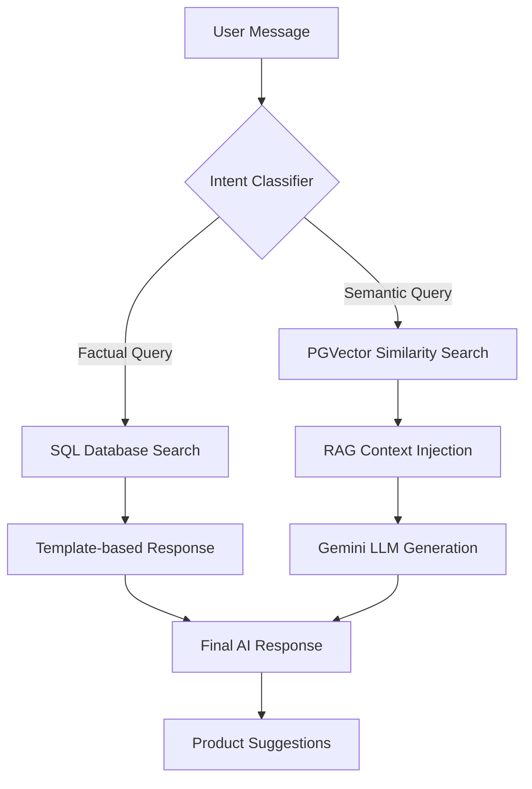
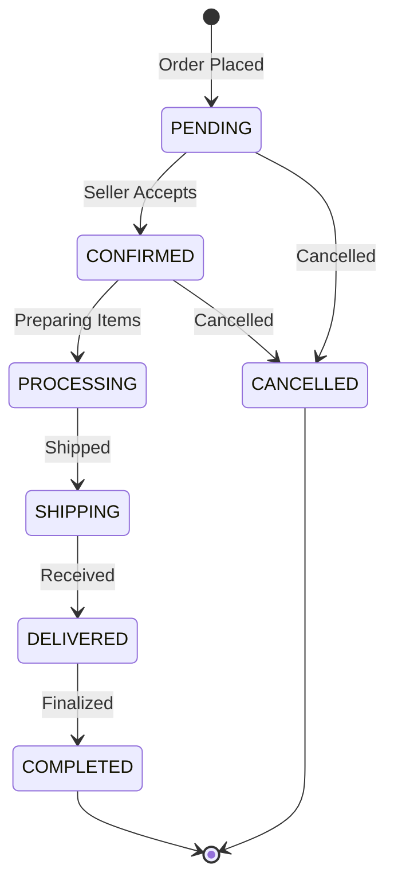

<div align="center">
  
# 🛒 E-Commerce Platform

[](https://openjdk.org/)
[](https://spring.io/projects/spring-boot)
[](https://reactjs.org/)
[](https://vitejs.dev/)
[](https://tailwindcss.com/)

**A premium, AI-enhanced e-commerce solution integrating Customers, Sellers, Admins, and Staff with advanced features like RAG Chatbot and eKYC.**

</div>

---

## 👥 The Team

<div align="center">
<table>
  <tr>
    <td align="center" width="160">
      <br/>
      <b>Phan Văn Huy</b><br/>
      <code>SE184969</code><br/>
    </td>
    <td align="center" width="160">
      <br/>
      <b>Trần Quốc Công</b><br/>
      <code>SE180709</code><br/>
    </td>
    <td align="center" width="160">
      <br/>
      <b>Trần Nhật Huy</b><br/>
      <code>SE180369</code><br/>
    </td>
  </tr>
  <tr>
    <td align="center" width="160">
      <br/>
      <b>Dương Xuân Sơn</b><br/>
      <code>SE181792</code><br/>
    </td>
    <td align="center" width="160">
      <br/>
      <b>Nguyễn Trung Tín</b><br/>
      <code>SE181711</code><br/>
    </td>
    <td align="center" width="160">
      <br/>
      <b>Nguyễn Đình Thanh</b><br/>
      <code>SE182854</code><br/>
    </td>
  </tr>
</table>
</div>

---

## 📖 Overview

The **E-Commerce Platform** is a sophisticated marketplace application built for the **SWD392 Capstone Project at FPT University**. It leverages a modern tech stack to provide a secure, scalable, and intelligent shopping experience.

### 🌟 Key Features

- **🤖 AI-Powered Intelligence**:
  - **Smart Chatbot**: Integrated with **Google Gemini (Gemma 3)** for natural language customer support.
  - **RAG (Retrieval-Augmented Generation)**: Uses **PGVector** for semantic search and context-aware product recommendations.
  - **Local Embeddings**: High-performance local text processing using ONNX models (`all-MiniLM-L6-v2`).
- **🛡️ Advanced Security & Identity**:
  - **VNPT eKYC**: Seamless integration for user identity verification.
  - **Role-Based Access Control (RBAC)**: Secure access for Admins, Sellers, Staff, and Customers.
  - **JWT Authentication**: Secure, stateless session management with access and refresh tokens.
- **💳 Integrated Payments**:
  - Native integration with **VNPAY** for secure online transactions.
- **📊 Real-time Analytics**:
  - Dynamic dashboards for Sellers (sales analytics)

---

## 🏗️ Architecture & Workflows

### 🤖 AI RAG Workflow
The platform uses a sophisticated Retrieval-Augmented Generation (RAG) pipeline for its AI features.


```mermaid
graph TD
    A[User Message] --> B{Intent Classifier}
    B -->|Factual Query| C[SQL Database Search]
    B -->|Semantic Query| D[PGVector Similarity Search]
    C --> E[Template-based Response]
    D --> F[RAG Context Injection]
    F --> G[Gemini LLM Generation]
    E --> H[Final AI Response]
    G --> H
    H --> I[Product Suggestions]
```

### 📦 Order Life Cycle
Orders follow a strict state machine to ensure consistency across Customer and Seller dashboards.


```mermaid
stateDiagram-v2
    [*] --> PENDING: Order Placed
    PENDING --> CONFIRMED: Seller Accepts
    CONFIRMED --> PROCESSING: Preparing Items
    PROCESSING --> SHIPPING: Shipped
    SHIPPING --> DELIVERED: Received
    DELIVERED --> COMPLETED: Finalized
    PENDING --> CANCELLED: Cancelled
    CONFIRMED --> CANCELLED: Cancelled
    COMPLETED --> [*]
    CANCELLED --> [*]
```

---

## 🛠️ Tech Stack & Key Technologies

### 💻 Backend
- **Core Framework**: Spring Boot 3.5.10 (Java 21)
- **AI Intelligence**:
  - **LLM**: Google Gemini (Gemma 3) via `spring-ai-google-genai`.
  - **Embeddings**: Local ONNX execution of `all-MiniLM-L6-v2`.
  - **Vector Store**: **pgvector** on PostgreSQL for high-speed semantic search.
- **Data Layer**:
  - **Main DB**: PostgreSQL (AWS RDS).
  - **Migrations**: Flyway (Schema versioning).
- **Security**: Spring Security + JWT (Stateless authentication).
- **Reporting**: Apache POI for generating Excel sales reports.

### 🎨 Frontend
- **Framework**: React 19 + Vite 7 (V3 Versioning).
- **Router**: React Router 7 (Single Page Application).
- **Styling**: TailwindCSS 4 (Utility-first with PostCSS).
- **Visualization**: Chart.js for real-time analytics dashboards.

---

## 🏗️ Project Structure

```text
.
├── backend/                # Spring Boot application
│   ├── src/main/java/      # Source code (ai, security, controller, service, etc.)
│   ├── src/main/resources/ # Configuration and database migrations (Flyway)
│   └── pom.xml             # Maven dependencies
├── frontend/               # React Vite application
│   ├── src/pages/          # Role-based pages (admin, seller, customer, staff)
│   ├── src/services/       # axios API layer
│   └── package.json        # Frontend dependencies
└── docker-compose.yml      # Local dev infra (PostgreSQL + pgvector)
```

---

## 🚀 Getting Started

### Prerequisites
- **JDK 21** or higher
- **Node.js 20+**
- **Maven 3.9+**
- **Docker** (for local database & vector search)

### Installation & Run

#### 1. Infrastructure Setup (Local)
Start the PostgreSQL instance with `pgvector` support:
```bash
docker-compose up -d
```

#### 2. Backend Setup
1. Navigate to `/backend`.
2. Configure `application.properties` with your database credentials and API keys.
3. Run:
```bash
./mvnw spring-boot:run
```

#### 3. Frontend Setup
1. Navigate to `/frontend`.
2. Install & Run:
```bash
npm install
npm run dev
```

Made with ❤️ by **SWD392 Team** at **FPT University**

</div>
