<div align="center">

# 🛒 E-Commerce Platform

[](https://openjdk.org/)
[](https://spring.io/projects/spring-boot)
[](https://reactjs.org/)
[](https://vitejs.dev/)
[](LICENSE)

<br/>

**A modern, full-featured e-commerce solution bridging Customers, Sellers, and Admins.**<br/>
_Built for the SWD392 Capstone Project at FPT University._

<br/>

[🚀 Getting Started](#-getting-started) • [✨ Key Features](#-key-features) • [🛠️ Tech Stack](#%EF%B8%8F-tech-stack) • [📚 API Docs](#-api-documentation)

</div>

<br/>

## 👥 The Team

<div align="center">
<table>
  <tr>
    <td align="center" width="160">
      <br/>
      <b>Phan Văn Huy</b><br/>
      <code>SE184969</code><br/>
    </td>
    <td align="center" width="160">
      <br/>
      <b>Trần Quốc Công</b><br/>
      <code>SE180709</code><br/>
    </td>
    <td align="center" width="160">
      <br/>
      <b>Trần Nhật Huy</b><br/>
      <code>SE180369</code><br/>
    </td>
  </tr>
  <tr>
    <td align="center" width="160">
      <br/>
      <b>Dương Xuân Sơn</b><br/>
      <code>SE181792</code><br/>
    </td>
    <td align="center" width="160">
      <br/>
      <b>Nguyễn Trung Tín</b><br/>
      <code>SE181711</code><br/>
    </td>
    <td align="center" width="160">
      <br/>
      <b>Nguyễn Đình Thanh</b><br/>
      <code>SE182854</code><br/>
    </td>
  </tr>
</table>
</div>

---

## 📖 Overview

The **E-Commerce Platform** is a comprehensive solution designed to simulate a real-world online marketplace. It facilitates interaction between three key actors: **Admins**, **Sellers**, and **Customers**.

### 🌟 Project Highlights

- **🛍️ Complete Marketplace**: Full lifecycle of product listing, searching, cart management, and checkout.
- **🤖 Artificial Intelligence**:
  - **Product Classification**: Automatically categorizes products uploaded by sellers using Natural Language Processing (NLP).
  - **Smart Recommendations**: Suggests products to customers based on their browsing and purchase history.
  - **Support Chatbot**: 24/7 AI assistant to handle common customer queries instantly.
- **💳 Integrated Payments**:
  - Seamless simulated integration with **VNPay** and **Momo** wallets.
  - Secure transaction processing flow.
- **🛡️ Advanced Security**:
  - Role-Based Access Control (RBAC) ensuring data privacy.
  - JWT Authentication for secure stateless sessions.
- **📊 Interactive Dashboards**:
  - Real-time sales analytics for Sellers.
  - System health and user management statistics for Admins.

---

## 🛠️ Tech Stack

<div align="center">

| **Category** | **Technologies**                                                                                                                                                                                                                                                                                                                                                                                                                                                                                                                                                                                                                                  |
| :----------: | :------------------------------------------------------------------------------------------------------------------------------------------------------------------------------------------------------------------------------------------------------------------------------------------------------------------------------------------------------------------------------------------------------------------------------------------------------------------------------------------------------------------------------------------------------------------------------------------------------------------------------------------------ |
| **Backend**  |      |
| **Frontend** |                                                                                                                                                                                           |
|  **DevOps**  |                                                                                                                                                                                                                                                                                                  |

</div>

---

## 🧩 Actors & Functional Requirements

The system is designed around **15 primary use cases**, ensuring a complete e-commerce flow supported by AI and secure payments.

### 👤 Customer

> _Authentication, Shopping, and Interaction_

- **Manage Account**: Personal profile and address management.
- **Browse Products**: Search, filter, and view details. _Includes: `Recommend Products` (AI)_.
- **Manage Shopping Cart**: Add, update, or remove items.
- **Place Order**: Complete checkout flow. _Includes: `Make Online Payment`_.
- **Order Tracking**: Monitor status (`Placed` → `Confirmed` → `Shipped` → `Delivered`).
- **Rate & Review**: Leave feedback for products.
- **Receive Support**: 24/7 assistance. _Includes: `Provide Chatbot Support` (AI)_.

### 🏪 Seller

> _Shop & Inventory Management_

- **Manage Shop**: Setup and update shop information.
- **Manage Products**: CRUD operations for inventory. _Includes: `Classify Products` (AI)_.
- **Manage Orders**: Confirm and ship customer orders.
- **View Sales Reports**: Track revenue and order statistics.

### 🛠 Admin

> _System Oversight_

- **Manage User Accounts**: Control platform access and roles.
- **Moderate Content**: Review and moderate products and user reviews.
- **View System Reports**: Monitor platform health and metrics.

---

## ⚙️ Subsystems & Integrations

The core platform integrates with specialized subsystems to enhance functionality without cluttering key business logic.

### 🤖 AI Subsystem

_A dedicated module for intelligence features._

- **Classify Products**: Auto-categorize products based on description.
- **Recommend Products**: Personalized suggestions engine.
- **Provide Chatbot Support**: NLP-driven customer assistance.
- **Analyze Customer Behavior**: Data processing for better UX.

### 💳 Payment Gateway

_Simulated financial transaction processor._

- **Process Online Payment**: Handle transactions via simulated VNPay/Momo.
- **Process Refund**: Manage reversals and cancelled orders.

---

## 🏗️ Architecture & Workflows

### System Architecture

The application follows a clean **Client-Server-Database** tier model with external service integrations.

```mermaid
graph LR
    User([👤 User]) <--> Client[React Frontend]
    Client <--> API[Spring Boot Backend]
    API <--> DB[(SQL Server)]

    subgraph Services
        API -.-> AI[🤖 AI Service]
        API -.-> Pay[💳 Payment Gateway]
    end
```



### Order Process Flow

A visualized journey of an order through the system.


---

## 🚀 Getting Started

### Prerequisites

Ensure you have the following installed:

| Tool     | Version | Download                              |
| -------- | ------- | ------------------------------------- |
| Java JDK | 21+     | [Download](https://adoptium.net/)     |
| Node.js  | 18+     | [Download](https://nodejs.org/)       |
| Maven    | 3.9+    | [Download](https://maven.apache.org/) |
| Git      | Latest  | [Download](https://git-scm.com/)      |

### Installation

#### 1️⃣ Clone the Repository

```bash
git clone https://github.com/your-username/ecommerce-platform.git
cd ecommerce-platform
```

#### 2️⃣ Backend Setup

```bash
# Navigate to backend directory
cd backend

# Install dependencies and build
mvn clean install

# Run the application
mvn spring-boot:run
```

> 🌐 Backend API available at: **http://localhost:8080**

#### 3️⃣ Frontend Setup

```bash
# Navigate to frontend directory
cd frontend

# Install dependencies
npm install

# Start development server
npm run dev
```

> 🌐 Frontend available at: **http://localhost:5173**

### Environment Configuration

Create the following configuration files:

<details>
<summary><b>📄 Backend - application.properties</b></summary>

```properties
# Server Configuration
server.port=8080

# Database Configuration
spring.datasource.url=jdbc:sqlserver://localhost:1433;databaseName=ecommerce
spring.datasource.username=your_username
spring.datasource.password=your_password

# JPA Configuration
spring.jpa.hibernate.ddl-auto=update
spring.jpa.show-sql=true

# JWT Configuration
jwt.secret=your_jwt_secret_key
jwt.expiration=86400000
```

</details>

<details>
<summary><b>📄 Frontend - .env</b></summary>

```env
VITE_API_BASE_URL=http://localhost:8080/api
VITE_APP_NAME=E-Commerce Platform
```

</details>

---

## 📚 API Documentation

Once the backend is running, access the API documentation at:

| Documentation | URL                                   |
| ------------- | ------------------------------------- |
| Swagger UI    | http://localhost:8080/swagger-ui.html |
| OpenAPI Spec  | http://localhost:8080/v3/api-docs     |

---

## 🤝 Contributing

We welcome contributions! Please follow these steps:

1. **Fork** the repository
2. **Create** a feature branch (`git checkout -b feature/AmazingFeature`)
3. **Commit** your changes (`git commit -m 'Add some AmazingFeature'`)
4. **Push** to the branch (`git push origin feature/AmazingFeature`)
5. **Open** a Pull Request

### Code Style Guidelines

- Follow Java naming conventions for backend
- Use ESLint rules for frontend
- Write meaningful commit messages
- Add appropriate documentation

---

## 📄 License

This project is licensed under the **MIT License** - see the [LICENSE](LICENSE) file for details.

---

<div align="center">

### ⭐ Star this repository if you found it helpful!

Made with ❤️ by **SWD392 Team** at **FPT University**

</div>
