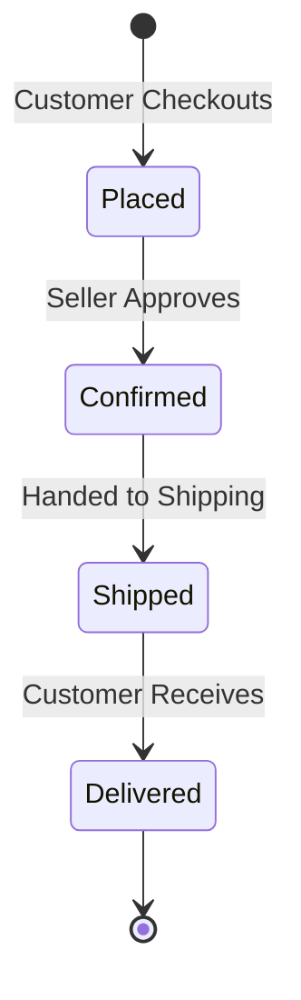

<div align="center">

# 🛒 E-Commerce Platform

[](https://openjdk.org/)
[](https://spring.io/projects/spring-boot)
[](https://reactjs.org/)
[](https://vitejs.dev/)
[](LICENSE)

<br/>

**A modern, full-featured e-commerce solution bridging Customers, Sellers, and Admins.**<br/>
_Built for the SWD392 Capstone Project at FPT University._

<br/>

[🚀 Getting Started](#-getting-started) • [📸 Screenshots](#-screenshots) • [🛠️ Tech Stack](#%EF%B8%8F-tech-stack) • [📚 API Docs](#-api-documentation)

</div>

<br/>

## 👥 The Team

<div align="center">
<table>
  <tr>
    <td align="center" width="160">
      <br/>
      <b>Phan Văn Huy</b><br/>
      <code>SE184969</code><br/>
      <a href="mailto:huypvse184969@fpt.edu.vn" title="Send Email">📧</a>
    </td>
    <td align="center" width="160">
      <br/>
      <b>Trần Quốc Công</b><br/>
      <code>SE180709</code><br/>
      <a href="mailto:congtqse180709@fpt.edu.vn" title="Send Email">📧</a>
    </td>
    <td align="center" width="160">
      <br/>
      <b>Trần Nhật Huy</b><br/>
      <code>SE180369</code><br/>
      <a href="mailto:huytnse180369@fpt.edu.vn" title="Send Email">📧</a>
    </td>
  </tr>
  <tr>
    <td align="center" width="160">
      <br/>
      <b>Dương Xuân Sơn</b><br/>
      <code>SE181792</code><br/>
      <a href="mailto:sondxse181792@fpt.edu.vn" title="Send Email">📧</a>
    </td>
    <td align="center" width="160">
      <br/>
      <b>Nguyễn Trung Tín</b><br/>
      <code>SE181711</code><br/>
      <a href="mailto:tinnntse181711@fpt.edu.vn" title="Send Email">📧</a>
    </td>
    <td align="center" width="160">
      <br/>
      <b>Nguyễn Đình Thanh</b><br/>
      <code>SE182854</code><br/>
      <a href="mailto:thanhndse182854@fpt.edu.vn" title="Send Email">📧</a>
    </td>
  </tr>
</table>
</div>

---

## 📖 Overview

The **E-Commerce Platform** is a comprehensive solution designed to simulate a real-world online marketplace. It facilitates interaction between three key actors: **Admins**, **Sellers**, and **Customers**.

Key highlights include:

- 🤖 **AI Integration**: Support for product classification and automated customer support chat.
- 💳 **Payments**: Integrated simulation for VNPay and Momo.
- 🔒 **Security**: Robust JWT-based authentication and role-based access control.

---

## 📸 Screenshots

<!--
    TODO: Replace the placeholder URLs below with your actual project screenshots.
    You can upload images to the repository or an image hosting service.
-->

|                                             Landing Page                                              |                                              Product Detail                                               |
| :---------------------------------------------------------------------------------------------------: | :-------------------------------------------------------------------------------------------------------: |
|  |  |

|                                               Seller Dashboard                                                |                                               Admin Analytics                                               |
| :-----------------------------------------------------------------------------------------------------------: | :---------------------------------------------------------------------------------------------------------: |
|  |  |

---

## 🛠️ Tech Stack

### Backend


### Frontend


### Infrastructure & Tools


---

## ✨ Key Features

### 🛍️ Customer

- **Smart Search**: Filter products by category, price, and rating.
- **AI Recommendations**: Personalized suggestions based on history.
- **Order Tracking**: Real-time status updates from placed to delivered.

### 🏪 Seller

- **Shop Management**: Customize profile and branding.
- **Inventory Control**: Add/edit products with **AI auto-classification**.
- **Sales Analytics**: Visual reports on revenue and orders.

### 👨‍💼 Admin

- **User Oversight**: Manage accounts and role permissions.
- **Content Moderation**: Review reported products and feedback.

---

## 🏗️ Architecture

The system utilizes a **Monorepo** structure with clear separation of concerns.

```mermaid
graph TD
    Client[📱 Frontend Client] -->|REST API| API[🛡️ Spring Boot Backend]
    API -->|Read/Write| DB[(🗄️ SQL Server)]
    API <-->|Analyze| AI[🤖 AI Service]
    API <-->|Transact| Payment[💳 Payment Gateway]
```



---

## 🔄 Order Lifecycle



---

## 🚀 Getting Started

### Prerequisites

Ensure you have the following installed:

| Tool     | Version | Download                              |
| -------- | ------- | ------------------------------------- |
| Java JDK | 21+     | [Download](https://adoptium.net/)     |
| Node.js  | 18+     | [Download](https://nodejs.org/)       |
| Maven    | 3.9+    | [Download](https://maven.apache.org/) |
| Git      | Latest  | [Download](https://git-scm.com/)      |

### Installation

#### 1️⃣ Clone the Repository

```bash
git clone https://github.com/your-username/ecommerce-platform.git
cd ecommerce-platform
```

#### 2️⃣ Backend Setup

```bash
# Navigate to backend directory
cd backend

# Install dependencies and build
mvn clean install

# Run the application
mvn spring-boot:run
```

> 🌐 Backend API available at: **http://localhost:8080**

#### 3️⃣ Frontend Setup

```bash
# Navigate to frontend directory
cd frontend

# Install dependencies
npm install

# Start development server
npm run dev
```

> 🌐 Frontend available at: **http://localhost:5173**

### Environment Configuration

Create the following configuration files:

<details>
<summary><b>📄 Backend - application.properties</b></summary>

```properties
# Server Configuration
server.port=8080

# Database Configuration
spring.datasource.url=jdbc:sqlserver://localhost:1433;databaseName=ecommerce
spring.datasource.username=your_username
spring.datasource.password=your_password

# JPA Configuration
spring.jpa.hibernate.ddl-auto=update
spring.jpa.show-sql=true

# JWT Configuration
jwt.secret=your_jwt_secret_key
jwt.expiration=86400000
```

</details>

<details>
<summary><b>📄 Frontend - .env</b></summary>

```env
VITE_API_BASE_URL=http://localhost:8080/api
VITE_APP_NAME=E-Commerce Platform
```

</details>

---

## 📚 API Documentation

Once the backend is running, access the API documentation at:

| Documentation | URL                                   |
| ------------- | ------------------------------------- |
| Swagger UI    | http://localhost:8080/swagger-ui.html |
| OpenAPI Spec  | http://localhost:8080/v3/api-docs     |

---

## 🤝 Contributing

We welcome contributions! Please follow these steps:

1. **Fork** the repository
2. **Create** a feature branch (`git checkout -b feature/AmazingFeature`)
3. **Commit** your changes (`git commit -m 'Add some AmazingFeature'`)
4. **Push** to the branch (`git push origin feature/AmazingFeature`)
5. **Open** a Pull Request

### Code Style Guidelines

- Follow Java naming conventions for backend
- Use ESLint rules for frontend
- Write meaningful commit messages
- Add appropriate documentation

---

## 📄 License

This project is licensed under the **MIT License** - see the [LICENSE](LICENSE) file for details.

---

<div align="center">

### ⭐ Star this repository if you found it helpful!

Made with ❤️ by **SWD392 Team** at **FPT University**

</div>
